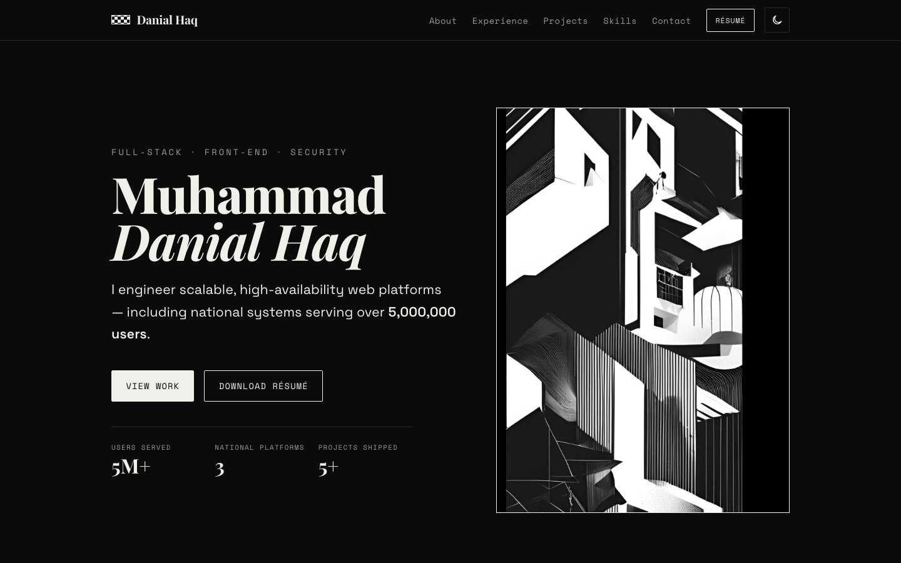

<div align="center">

# Muhammad Danial Haq

**Full-Stack Developer · Front-end Developer · Security Engineer**

A personal portfolio — plain HTML, CSS and vanilla JavaScript. No build step, no framework.


</div>

---

I'm a full-stack developer with a background in network security. I've engineered scalable,
high-availability web applications for nationwide platforms serving over **5,000,000 users** —
including the Ministry of Education's DELIMa 3.0 and DELIMaFLIX, and KEMAS digital portals.

This repository is the source for my portfolio: a single static site with a monochrome,
editorial design, light/dark themes and no dependencies.

## Preview



## Sections

- **Hero** — introduction and key figures
- **About** — background, focus areas and quick facts
- **Experience** — roles at MATA Inisiatif, Adaptive Netpoleon and UTHM
- **Projects** — DELIMa 3.0, KEMAS EduCeria, DELIMaFLIX, Sendiri Bake, DSG
- **Skills** — grouped tools and technologies
- **Academic projects** — coursework highlights
- **Contact** — email, LinkedIn and GitHub

## Features

- Monochrome brutalist / editorial design
- Light and dark themes, following system preference and remembered in `localStorage`
- Fully responsive with a mobile navigation menu
- Scroll-spy navigation, smooth anchor scrolling and reveal-on-scroll animations
- Accessible: semantic landmarks, keyboard navigation, focus styles, `prefers-reduced-motion`
- Progressive enhancement — content stays visible without JavaScript

## Tech stack

| Layer | Details |
| --- | --- |
| Markup | Semantic HTML5 |
| Styling | Hand-written CSS with custom properties (no framework) |
| Behaviour | Vanilla JavaScript (no libraries) |
| Fonts | Playfair Display, Space Grotesk, Space Mono (Google Fonts) |

## Project structure

```
.
├── index.html
├── css/
│   └── style.css
├── js/
│   └── main.js
├── assets/
│   ├── header.jpg
│   ├── about.jpg
│   ├── preview.png
│   ├── resume.pdf
│   └── favicon.svg
├── .do/
│   └── app.yaml          # DigitalOcean App Platform spec
└── README.md
```

## Contact

- Email — [danialhaq23@gmail.com](mailto:danialhaq23@gmail.com)
- LinkedIn — [linkedin.com/in/danial-roseman](https://www.linkedin.com/in/danial-roseman/)
- GitHub — [github.com/danialroseman](https://github.com/danialroseman)

---

<div align="center">
<sub>© Muhammad Danial Haq Bin Rose Man</sub>
</div>
